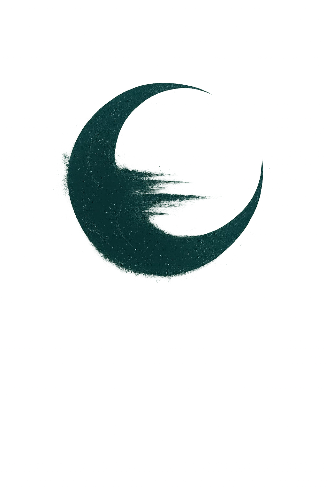

  

<h1 align="center">Veilborne</h1>

<em>Horizons dissolve before they arrive.</em>

---

## About the game

**Veilborne** is a first-person, open-world voxel sandbox set in a surreal fantasy world where horizons never quite hold. Procedurally generated terrain stretches in every direction, stitched together from twelve distinct biomes — from the void-hummed **Nullscape** between worlds to glowing jungles, blood-hungry wilds, frozen tundras, and deserts of shattered glass.

There is no fixed quest or end goal. Walk the land, dig into the earth, and watch the world evolve over time.

### What you can do

- **Explore** an infinite procedurally generated world with biome blending, varied terrain, and procedural vegetation
- **Dig and sculpt** voxel terrain in real time with configurable tools
- **Discover** hidden ores — coal, iron, copper, and gold — buried at depth across different biomes
- **Traverse** forests, marshes, tundras, deserts, and stranger places where reality wears thin

### The world

Each biome carries its own character, terrain, flora, and buried resources. A few examples:

| Biome | Character |
|---|---|
| **Nullscape** | The void between worlds — static hums, and reality unravels |
| **Aetherwild Grove** | A magical jungle pulsing with radiant life |
| **Bloodpetal Wilds** | A lush jungle of beauty and horror, where every flower hungers |
| **Frostveil Tundra** | A frozen land of silence and pale light |
| **Obsidian Expanse** | A vast sea of cooled glass, reflecting fire and stars alike |
| **Shatterglass Desert** | Sunlight fractures through dunes of shimmering glass |

Veilborne is an open-ended experiment — a game created through vibe coding with no predetermined destination. We will just see where this ends up over time.

---

  <a href="#contributing-rules"><strong>Contributing Rules</strong></a>

---

## Contributing Rules

1. The majority of code is to be written by an AI
2. You can do minor code changes to optimise what the AI has produced.
   - Example 1: The AI was asked to refactor code into a class and dependency inject. It does but keep the old code as a fallback in a try catch. You can remove the catch (and old code), and just use the new class.
   - Example 2: The AI makes a class but doesn’t use it. You can remove the class, or if you know where it should be implemented you are free to implement said class.
3. Code must be added as a pull request with a description of what was meant to achieve.
4. You can add assets and models to the project for the AI to use as the AI cannot generate its own assets.
    - NOTE: Assets must be compatible with the MIT licence.
    - Example: A model of a tree that the AI can use to display trees.
